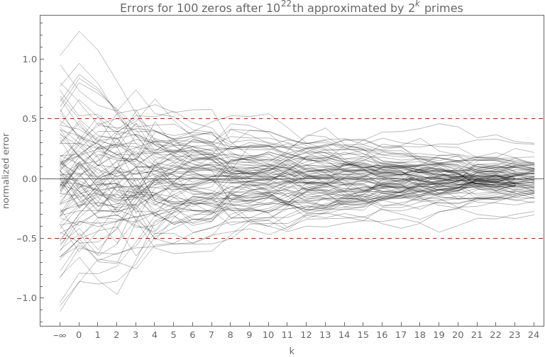

# Zeta Zeros Zeal
fast approximation of large Riemann zeta zeros on the critical line

```text
Usage: zzz [OPTION...] N [offset]
fast approximation of large Riemann zeta zeros

  -d, --digits=DIGITS        extra digits for number formatting [default 4]
  -e, --evaluate             evaluate Riemann zeta function value at the
                             approximate zero location
  -k, --k=K                  use first k primes for zero counting function
                             approximation [default 100]
  -p, --precision=PREC       arb precision for counting function approximation
                             [default 256]
  -t, --tolerance=TOL        tolerance for bisection [default 0.5]
  -v, --verbose              verbose progress output
  -w, --window=WIN           initial span around Lambert W asymptotic zero
                             location +- WIN [default 1.5]
  -z, --zeta-prec=ZETA_PREC  arb precision for zeta evaluation [default 64]
  -?, --help                 Give this help list
      --usage                Give a short usage message
  -V, --version              Print program version
```

## Zero counting function approximation

Combines quadratic and cubic spline with correct frequency and tangents to match the amplitude.


## Towards convergence



## Error distribution

In comparison with k=0 (basic Lambert W approximation).


# Approximate n-th zero locations

## Zero # 10^12 + 1

see [~odlyzko/zeta_tables/zeros3](https://www-users.cse.umn.edu/~odlyzko/zeta_tables/zeros3)

```bash
$time ./zzz -e -k 1000 1e12 +1
```

```
argument s = 	(0.5000000000000000 + 267653395648.8477j)  +/-  (0, 1.05e-65j)
value    z = 	(-0.01633683696845106 - 0.005421210637911910j)  +/-  (1.17e-20, 1.05e-20j)
267653395648.8477

real	0m0.270s
user	0m0.264s
sys	0m0.005s
```

## Zero # 10^36 + 42420637374017961984

```bash
$ time ./zzz -k 10000 1e36 42420637374017961984 | tail -n1
```

```text
81029194732694548890047854481676713.01026

real	0m2.096s
user	0m2.083s
sys	0m0.003s
```

```
81029194732694548890047854481676712.93997   prev approximate     #10^36+42420637374017961983
81029194732694548890047854481676712.98790          published     #10^36+42420637374017961984
81029194732694548890047854481676713.01026        approximate     #10^36+42420637374017961984
81029194732694548890047854481676713.08806   next approximate     #10^36+42420637374017961985
```


# Literature

* Bernhard Riemann: *On the Number of Prime Numbers less than a Given Quantity*.
  * https://www.claymath.org/sites/default/files/ezeta.pdf
* Jonathan W. Bober, Ghaith A. Hiary: *New computations of the Riemann zeta function on the critical line*
  * https://arxiv.org/abs/1607.00709
* M. V. Berry, J. P. Keating: *The Riemann Zeros and Eigenvalue Asymptotics*
  * https://empslocal.ex.ac.uk/people/staff/mrwatkin/zeta/berry-keating1.pdf
