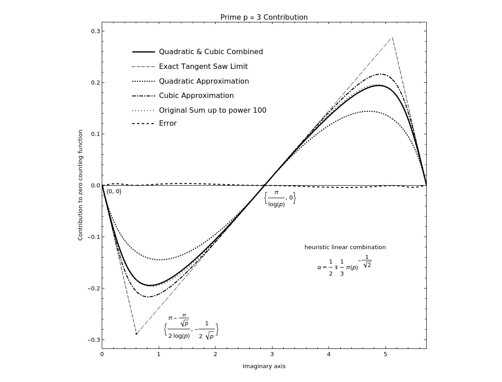
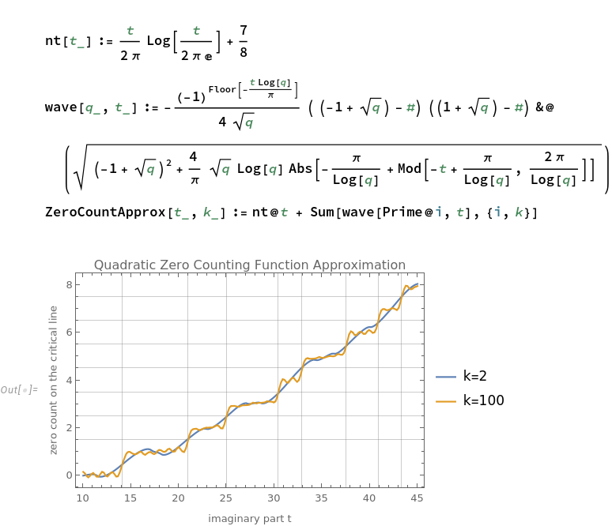
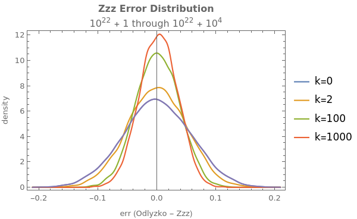

# Zeta Zeros Zeal
fast approximate location of large Riemann zeta zeros on the critical line

```text
Usage: zzz [OPTION...] N [offset]
fast approximation of large Riemann zeta zeros

  -d, --digits=DIGITS        extra digits for number formatting [default 4]
  -e, --evaluate             evaluate Riemann zeta function value at the
                             approximate zero location
  -k, --k=K                  use first k primes for zero counting function
                             approximation [default 100]
  -p, --precision=PREC       arb precision for counting function approximation
                             [default 256]
  -t, --tolerance=TOL        tolerance for bisection [default 0.5]
  -w, --window=WIN           initial span around Lambert W asymptotic zero
                             location +- WIN [default 1.5]
  -z, --zeta-prec=ZETA_PREC  arb precision for zeta evaluation [default 64]
  -?, --help                 Give this help list
      --usage                Give a short usage message
  -V, --version              Print program version
```


## Quadratic approximation

matching periods amplitudes and tangents 



## Approximate zero counting function

using first `k` primes



## Error distribution

in comparison with k=0 (basic ProductLog approximation)



# Approximate n-th zero locations

## Zero # 10^22 + 1

see [~odlyzko/zeta_tables/zeros5](https://www-users.cse.umn.edu/~odlyzko/zeta_tables/zeros5)

```bash
$ time ./zzz -k 10000 1e22 +1
```

```text
...
zeta zero imaginary part lower approximation lo_t = 1370919909931995308226.6948 +/- 5.9440e-56
zeta zero imaginary part upper approximation hi_t = 1370919909931995308226.6955 +/- 5.9440e-56

zero counting function lower bound lo = 10000000000000000000000.499 +/- 8.7894e-51
zero counting function upper bound hi = 10000000000000000000000.506 +/- 8.7894e-51

zeta zero imaginary part lower approximation lo_t = 1370919909931995308226.6948 +/- 5.9440e-56
zeta zero imaginary part upper approximation hi_t = 1370919909931995308226.6955 +/- 5.9440e-56

(0.50000000000000000000000000 + 1370919909931995308226.6952j)  +/-  (0, 5.94e-56j)


To be refined.

1370919909931995308226.6952

real	0m2.600s
user	0m2.585s
sys	0m0.003s
```

## Zero # 10^36 + 42420637374017961984

```bash
$ time ./zzz -k 100000 1e36 42420637374017961984 | tail -n1

81029194732694548890047854481676713.01539

real	0m22.716s
user	0m22.541s
sys	0m0.002s
```

```
81029194732694548890047854481676712.93997   prev approximate     #10^36+42420637374017961983
81029194732694548890047854481676712.98790          published     #10^36+42420637374017961984
81029194732694548890047854481676713.01539        approximate     #10^36+42420637374017961984
81029194732694548890047854481676713.09538   next approximate     #10^36+42420637374017961985
```


# Literature

* Bernhard Riemann: *On the Number of Prime Numbers less than a Given Quantity*.
  * https://www.claymath.org/sites/default/files/ezeta.pdf
* Jonathan W. Bober, Ghaith A. Hiary: *New computations of the Riemann zeta function on the critical line*
  * https://arxiv.org/abs/1607.00709
* M. V. Berry, J. P. Keating: *The Riemann Zeros and Eigenvalue Asymptotics*
  * https://empslocal.ex.ac.uk/people/staff/mrwatkin/zeta/berry-keating1.pdf
