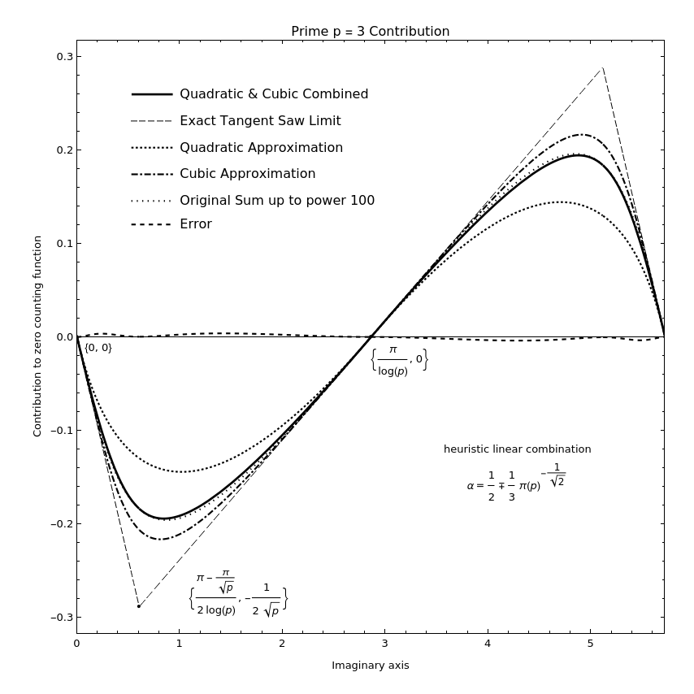
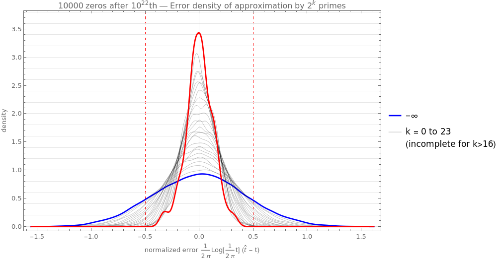
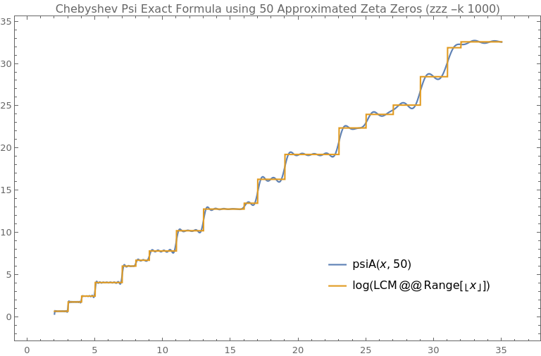
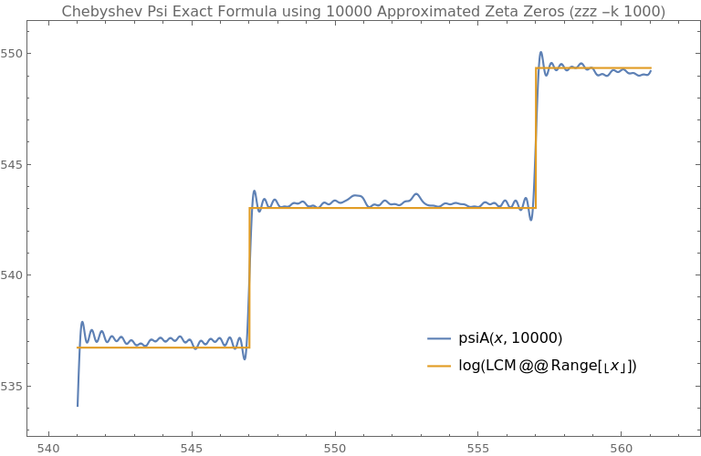
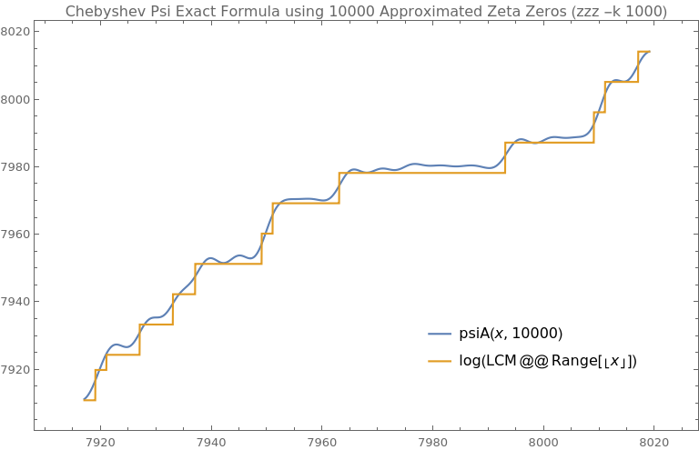

# Zeta Zeros Zeal
fast approximation of large Riemann zeta zeros on the critical line

```text
Usage: zzz [OPTION...] N [offset] [count]
fast approximation of large Riemann zeta zeros

  -B, --boot=W               self-consistent hybrid bootstrap: seed 2W+1 zeros
                             with P_X, then iterate leave-one-out P_X*Z_X
                             relocation (implies --ghy)
  -d, --digits=DIGITS        extra digits for number formatting [default 6]
  -e, --evaluate             evaluate Riemann zeta function value at the
                             approximate zero location
  -g, --debug                debug counting function from <N> to <N+offset> in
                             <count> steps
  -G, --ghy                  use GHY partial Euler P_X (X = p_k) instead of
                             heuristic damping
  -k, --k=K                  use first k primes for zero counting function
                             approximation [default 100]
  -p, --precision=PREC       arb precision for counting function approximation
                             [default 256]
  -R, --rounds=R             bootstrap relocation rounds [default 2]
  -t, --tolerance=TOL        tolerance for bisection [default 1e-6]
  -v, --verbose              verbose progress output
  -w, --window=WIN           initial span around Lambert W asymptotic zero
                             location +- WIN [default 1.5]
  -W, --weil                 Weil explicit-formula window fit: refine <count>
                             consecutive zeros around ordinal N+offset in one
                             shot; needs gap*log(p_k) > pi (see
                             doc/notes/band-saturation.md)
  -z, --zeta-prec=ZETA_PREC  arb precision for zeta evaluation [default 64]
  -?, --help                 Give this help list
      --usage                Give a short usage message
  -V, --version              Print program version
```

The `--ghy` flag swaps the heuristic damping for the Gonek–Hughes–Young
partial Euler factor $P_X$, placing the counter inside a provable error
chain (RH + GHY Thm 1 + Goldston 1987). Aux binaries `zproxy`, `zghy`,
`zhad`, `zhybrid` dump the various inner factors on TSV grids. See
[`doc/ghy.md`](doc/ghy.md) for the design and the rigor reference.

## Self-consistent hybrid bootstrap (`--boot W`)

`--boot W` makes the GHY hybrid $P_X \cdot Z_X$ **self-hosting**: it seeds
$2W+1$ neighbouring zeros with the primes-only counter, then re-locates the
inner core with a leave-one-out hybrid count (each zero excluded from its own
$Z_X$), iterating to a fixed point. No zero tables are consumed; the chain
stays zeta-evaluation-free.

Validated against Odlyzko's tables (`doc/ghy/boot-validate.sh`, 20 zeros per
height, `--boot 32`, mean |error| vs plain `--ghy` at the same k):

| height | k | `--ghy` | `--boot 32` | gain |
|---|---|---|---|---|
| n ≈ 10³ | 1000 | 0.0153 | **0.0008** | **19×** |
| n ≈ 10⁵ | 1000 | 0.0179 | 0.0064 | 2.8× |
| 10¹² | 10⁴ | 0.0089 | 0.0044 | 2.0× |
| 10²¹–10²² | 10⁴ | — | — | none |

The gain switches off where $X \lesssim \sqrt{T/2\pi}$ (the Riemann–Siegel
scale): below it the truncation deficit is coherent across neighbouring zeros
and the self-computed seeds cannot see past it. Inside its domain the
bootstrap reaches accuracies the $1/\log X$ law denies to $P_X$ at any
feasible prime count. Derivation, stability analysis (guard ring, basin-hop
rejection, the purely-imaginary-$E_1$ pitfall) and the validity threshold:
[`doc/notes/bootstrap-hybrid.md`](doc/notes/bootstrap-hybrid.md).

## Weil window fit (`--weil`)

Above the same threshold, `--weil` extracts the band's surplus optimally:
it seeds a window of consecutive zeros with $P_X$ at a reduced prime count
(marching), then refines all of them in one least-squares fit against exact
Riemann–Weil functionals of the primes — no kernel approximation, the full
field instead of one crossing per zero. Validated against Odlyzko:

| height | k | `--ghy` | `--boot 32` | `--weil` |
|---|---|---|---|---|
| n ≈ 10³ | 1000 | 0.0153 | 0.0008 | **0.00002** (in 2.8 s) |
| 10¹² | 10⁵ | 0.0176 | 0.0106 | **0.0028** (10 zeros in 1.8 min) |

```bash
$ ./zzz --weil -k 1000 996 0 9        # nine zeros around #1000, one window
1415.585795                            # true 1415.585784795
...
1419.422456                            # true 1419.422480946 (B: 1419.447701)
```

Combines with `-e` to evaluate $\zeta$ at each refined zero. Kernel in
`weil.{c,h}`; theory and the validity regime in
[`doc/notes/band-saturation.md`](doc/notes/band-saturation.md).

Below that threshold nothing can beat plain `--ghy` from the same primes:
crossing relocation, kernel ML, multi-cutoff ML and exact Weil-identity
fitting all reproduce its errors, and a truth control shows the true zeros
and the `--ghy`-displaced ones are indistinguishable to every band-limited
functional of $p^m \le X$. The measured saturation principle, its
consequences (the wall scales as $\sqrt{T/2\pi}$ — feasibility, not
impossibility) and why the lowest-$k$ primes are the optimal selection:
[`doc/notes/band-saturation.md`](doc/notes/band-saturation.md).

```bash
$ time ./zzz --boot 32 -k 1000 -d 8 1e12 +1  # zero #10^12+1, true 267653395648.8475231
267653395648.84975665                        # |err| 0.0022 (--ghy alone: 0.0041)

real    0m12.7s
```

## Zero counting function approximation

Note: obsolete inner sum approximation, not used any more.

Combines quadratic and cubic spline with correct frequency and tangents to match the amplitude.



## Towards convergence


## Error distribution

In comparison with k=-∞ (basic Lambert W approximation).



# Approximate n-th zero locations

## Zero # 10^12 + 1

see [~odlyzko/zeta_tables/zeros3](https://www-users.cse.umn.edu/~odlyzko/zeta_tables/zeros3)

```bash
$ time ./zzz -ve -k 1000 1e12 +1
```

```
argument s =    (0.500000000000000000 + 267653395648.844684j)  +/-  (0, 1.05e-65j)
value    z =    (0.355290959100415380 + 0.132397324302526229j)  +/-  (3.70e-20, 2.34e-20j)
267653395648.844684

real    0m0.470s
user    0m0.456s
sys     0m0.007s
```

## Zero # 10^36 + 42420637374017961984

```bash
$ time ./zzz -k 10000 1e36 42420637374017961984
81029194732694548890047854481676713.009431

real    0m1.473s
```

```
81029194732694548890047854481676712.94002   prev approximate     #10^36+42420637374017961983
81029194732694548890047854481676712.98790          published     #10^36+42420637374017961984
81029194732694548890047854481676713.00943        approximate     #10^36+42420637374017961984
81029194732694548890047854481676713.08748   next approximate     #10^36+42420637374017961985
```

```bash
$ time ./zzz --ghy -k 10000 1e36 42420637374017961984
81029194732694548890047854481676713.009348

real    0m0.631s
```

At this height `--boot` is past its validity domain ($X = p_{10^4} \ll
\sqrt{T/2\pi} \approx 10^{18}$): ensemble tests show no expected gain, and
isolated improvements (e.g. `--boot 32` reaching …712.9936, error 0.0057)
are fluctuations, not method. See
[`doc/notes/bootstrap-hybrid.md`](doc/notes/bootstrap-hybrid.md).

## Chebyshev Psi Exact Formula

Using zeros approximated by `zzz -k 1000`.

range 0 to 20  (50 zeros)                    |    range 541 to 661 (1,000 zeros)               | range 7920-8020 (10,000 zeros)
:-------------------------------------------:|:-----------------------------------------------:|:------------------------------------------------:
 |  | 


# Literature

* Bernhard Riemann: *On the Number of Prime Numbers less than a Given Quantity*.
  * https://www.claymath.org/sites/default/files/ezeta.pdf
* Jonathan W. Bober, Ghaith A. Hiary: *New computations of the Riemann zeta function on the critical line*
  * https://arxiv.org/abs/1607.00709
* M. V. Berry, J. P. Keating: *The Riemann Zeros and Eigenvalue Asymptotics*
  * https://empslocal.ex.ac.uk/people/staff/mrwatkin/zeta/berry-keating1.pdf
* Guilherme França, André LeClair: *Statistical and other properties of Riemann zeros based on an explicit equation for the n-th zero on the critical line*
  * https://arxiv.org/abs/1307.8395
* Steven M. Gonek, Christopher P. Hughes, Matthew P. Young: *A hybrid Euler–Hadamard product for the Riemann zeta function*, Duke Math. J. **136** (2007), 507–549.
  * https://arxiv.org/abs/math/0511092
* Daniel A. Goldston: *On the function S(T) in the theory of the Riemann zeta-function*, J. Number Theory **27** (1987), 149–177.
  * https://doi.org/10.1016/0022-314X(87)90061-4
