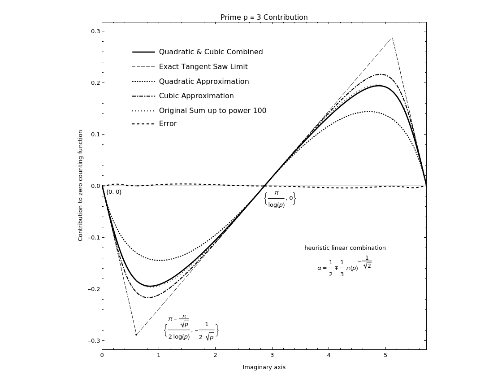
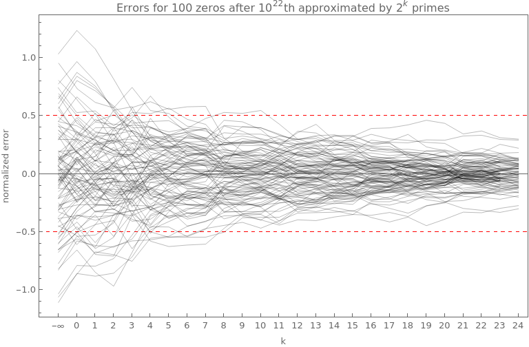
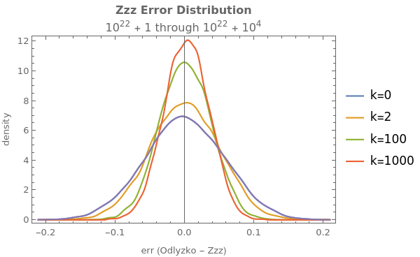
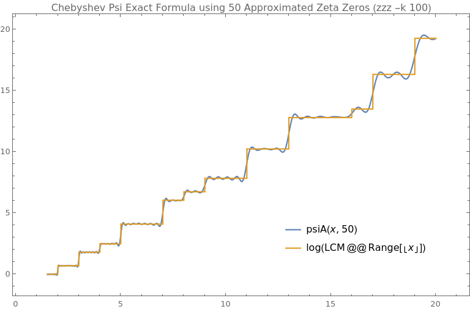

# Zeta Zeros Zeal
fast approximation of large Riemann zeta zeros on the critical line

```text
Usage: zzz [OPTION...] N [offset] [count]
fast approximation of large Riemann zeta zeros

  -d, --digits=DIGITS        extra digits for number formatting [default 6]
  -e, --evaluate             evaluate Riemann zeta function value at the
                             approximate zero location
  -g, --debug                debug counting function from <N> to <N+offset> in
                             <count> steps
  -G, --ghy                  use GHY partial Euler P_X (X = p_k) instead of
                             heuristic damping
  -k, --k=K                  use first k primes for zero counting function
                             approximation [default 100]
  -p, --precision=PREC       arb precision for counting function approximation
                             [default 256]
  -t, --tolerance=TOL        tolerance for bisection [default 1e-6]
  -v, --verbose              verbose progress output
  -w, --window=WIN           initial span around Lambert W asymptotic zero
                             location +- WIN [default 1.5]
  -z, --zeta-prec=ZETA_PREC  arb precision for zeta evaluation [default 64]
  -?, --help                 Give this help list
      --usage                Give a short usage message
  -V, --version              Print program version
```

## Counting modes

`zzz` exposes two zeta-evaluation-free counting functions; both bisect for
the n-th zero with the same driver and CLI.

**default (heuristic).**
$F_A(T) = N_0(T) + \tfrac{1}{\pi}\operatorname{Im}\sum_{p\le p_k}(1-e^{-\sqrt{T/p}})\log(1-p^{-1/2+iT})$.
Smooth damping that pre-suppresses primes with $p\gtrsim T$. No provable
error bound; empirically `|F_A − N| ~ 10⁻²` at `k = 1000` across the scan.

**`--ghy` (rigorous).**
$F_B(T) = N_0(T) + \tfrac{1}{\pi}\arg P_X(\tfrac{1}{2}+iT)$ with
$\log P_X = \sum_{p^m\le X} 1/(m\,p^{ms})$ and $X = p_k$
(Gonek–Hughes–Young 2007, eq. 6). Carries the bound
$|F_B - N| \le \tfrac{1}{\pi}\tfrac{\log T}{\log X} + O(\tfrac{\log X}{\sqrt X})$
under RH (Goldston 1987 + GHY Thm 1).

The two methods are empirically equivalent in the production regime
(`T ≳ 10⁶`, `k ≲ 10⁴`); see `doc/notes/rigor-bound-b.md` for the numerical
confrontation. **Validity caveat for `--ghy`:** at very low zeros
(`T ≲ 100`), B is only inside its rigor regime while `k ≲ π(T log T)`;
raising k beyond that drifts B away from the true zero. The heuristic A
self-limits via its damping and stays accurate. See
`doc/notes/low-zero-regime.md`.

Auxiliary binaries `zhybrid`, `zghy`, `zhad`, `zproxy` evaluate the related
GHY proxies on grids; `zhybrid` implements the full hybrid `P_X · Z_X` with
seed zeros (rigorous error `O(log X / √X)`).

## Zero counting function approximation

Note: obsolete inner sum approximation, not used any more.

Combines quadratic and cubic spline with correct frequency and tangents to match the amplitude.



## Towards convergence



## Error distribution

In comparison with k=-∞ (basic Lambert W approximation).



# Approximate n-th zero locations

## Zero # 10^12 + 1

see [~odlyzko/zeta_tables/zeros3](https://www-users.cse.umn.edu/~odlyzko/zeta_tables/zeros3)

```bash
$ time ./zzz -ve -k 1000 1e12 +1
```

```
argument s =    (0.500000000000000000 + 267653395648.844684j)  +/-  (0, 1.05e-65j)
value    z =    (0.355290959100415380 + 0.132397324302526229j)  +/-  (3.70e-20, 2.34e-20j)
267653395648.844684

real    0m0.470s
user    0m0.456s
sys     0m0.007s
```

## Zero # 10^36 + 42420637374017961984

```bash
  $ time ./zzz -k 10000 1e36 42420637374017961984
```

```text
81029194732694548890047854481676713.009431

real    0m1.473s
```

```bash
  $ time ./zzz --ghy -k 10000 1e36 42420637374017961984
```

```text
81029194732694548890047854481676713.009348

real    0m0.631s
```

The rigorous `--ghy` mode is ~2× faster: its per-prime kernel is
$1/(m\,p^{ms})$ (one `pow`, no `log`, no `exp`), whereas A spends a
`log(1 - p^{-s})` and a damping `exp(-\sqrt{T/p})` per prime.

```
81029194732694548890047854481676712.93994   prev approximate (B)  #10^36+42420637374017961983
81029194732694548890047854481676712.94002   prev approximate (A)  #10^36+42420637374017961983
81029194732694548890047854481676712.98790          published      #10^36+42420637374017961984
81029194732694548890047854481676713.00935        approximate (B)  #10^36+42420637374017961984
81029194732694548890047854481676713.00943        approximate (A)  #10^36+42420637374017961984
81029194732694548890047854481676713.08748   next approximate (A)  #10^36+42420637374017961985
81029194732694548890047854481676713.08750   next approximate (B)  #10^36+42420637374017961985
```

A and B agree to seven decimal digits at this height; both land
~$0.022$ above the published value, comfortably inside the $\pm 0.07$
neighbour gap and consistent with GHY/Goldston's $\sim 0.04$ provable
ceiling at $T = 10^{36}$, $X = p_{10000}$.

## Chebyshev Psi Exact Formula

Using zeros approximated by `zzz -k 1000`.

range 0 to 20  (50 zeros)          |    range 541 to 661 (1,000 zeros)     | range 7920-8020 (10,000 zeros)  
:---------------------------------:|:-------------------------------------:|:--------------------------------------:
 |  | 


# Literature

* Bernhard Riemann: *On the Number of Prime Numbers less than a Given Quantity*.
  * https://www.claymath.org/sites/default/files/ezeta.pdf
* Jonathan W. Bober, Ghaith A. Hiary: *New computations of the Riemann zeta function on the critical line*
  * https://arxiv.org/abs/1607.00709
* M. V. Berry, J. P. Keating: *The Riemann Zeros and Eigenvalue Asymptotics*
  * https://empslocal.ex.ac.uk/people/staff/mrwatkin/zeta/berry-keating1.pdf
* Guilherme França, André LeClair: *Statistical and other properties of Riemann zeros based on an explicit equation for the n-th zero on the critical line*
  * https://arxiv.org/abs/1307.8395
