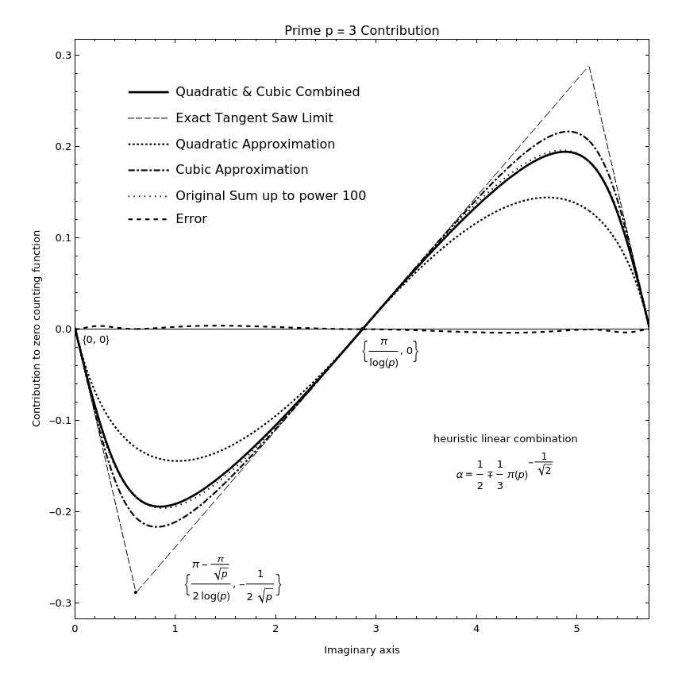
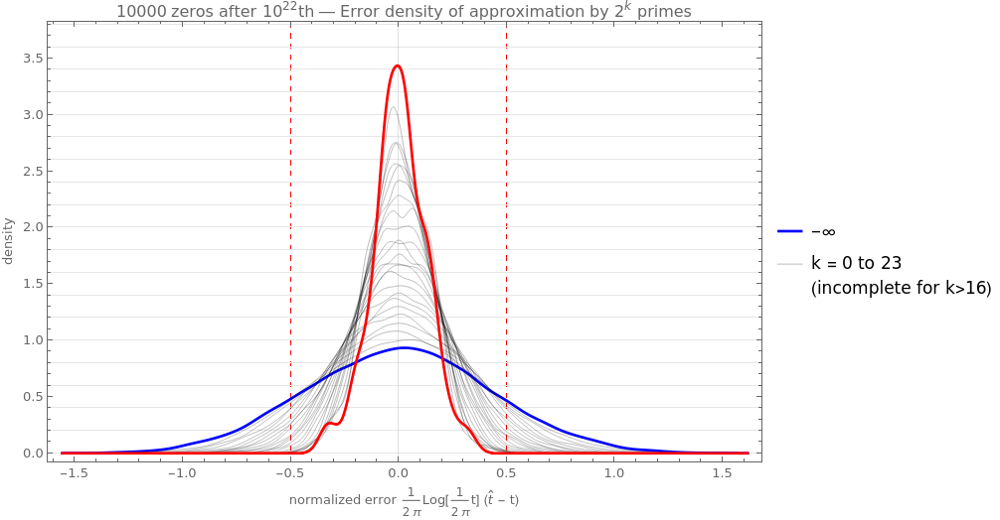
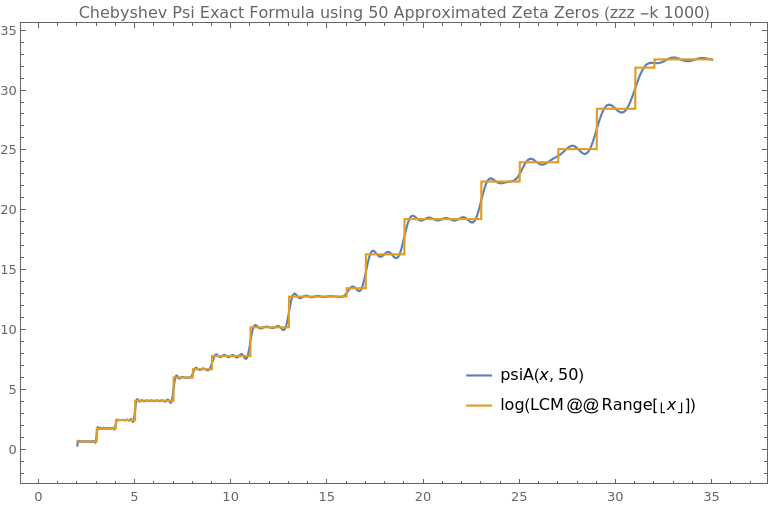

# Zeta Zeros Zeal
fast approximation of large Riemann zeta zeros on the critical line

```text
Usage: zzz [OPTION...] N [offset] [count]
fast approximation of large Riemann zeta zeros

  -d, --digits=DIGITS        extra digits for number formatting [default 6]
  -e, --evaluate             evaluate Riemann zeta function value at the
                             approximate zero location
  -g, --debug                debug counting function from <N> to <N+offset> in
                             <count> steps
  -k, --k=K                  use first k primes for zero counting function
                             approximation [default 100]
  -p, --precision=PREC       arb precision for counting function approximation
                             [default 256]
  -t, --tolerance=TOL        tolerance for bisection [default 1e-6]
  -v, --verbose              verbose progress output
  -w, --window=WIN           initial span around Lambert W asymptotic zero
                             location +- WIN [default 1.5]
  -z, --zeta-prec=ZETA_PREC  arb precision for zeta evaluation [default 64]
  -?, --help                 Give this help list
      --usage                Give a short usage message
  -V, --version              Print program version
```

## Zero counting function approximation

Combines quadratic and cubic spline with correct frequency and tangents to match the amplitude.



## Towards convergence


## Error distribution

In comparison with k=0 (basic Lambert W approximation).



# Approximate n-th zero locations

## Zero # 10^12 + 1

see [~odlyzko/zeta_tables/zeros3](https://www-users.cse.umn.edu/~odlyzko/zeta_tables/zeros3)

```bash
$ time ./zzz -ve -k 1000 1e12 +1
```

```
argument s = 	(0.500000000000000000 + 267653395648.847393j)  +/-  (0, 1.05e-65j)
value    z = 	(0.0166724860775396361 + 0.00559081254510210870j)  +/-  (1.17e-20, 1.05e-20j)
267653395648.847393

real	0m0.425s
user	0m0.418s
sys	0m0.004s
```

## Zero # 10^36 + 42420637374017961984

```bash
  $ time ./zzz -k 10000 1e36 42420637374017961984
```

```text
81029194732694548890047854481676713.010104

real	0m3.633s
user	0m3.620s
sys	0m0.002s
```

```
81029194732694548890047854481676712.94005   prev approximate     #10^36+42420637374017961983
81029194732694548890047854481676712.98790          published     #10^36+42420637374017961984
81029194732694548890047854481676713.01010        approximate     #10^36+42420637374017961984
81029194732694548890047854481676713.08837   next approximate     #10^36+42420637374017961985
```

## Chebyshev Psi Exact Formula

Using zeros approximated by `zzz -k 1000`.

range 0 to 20  (50 zeros)          |    range 541 to 661 (1,000 zeros)     | range 7920-8020 (10,000 zeros)  
:---------------------------------:|:-------------------------------------:|:--------------------------------------:
 |  | 


# Literature

* Bernhard Riemann: *On the Number of Prime Numbers less than a Given Quantity*.
  * https://www.claymath.org/sites/default/files/ezeta.pdf
* Jonathan W. Bober, Ghaith A. Hiary: *New computations of the Riemann zeta function on the critical line*
  * https://arxiv.org/abs/1607.00709
* M. V. Berry, J. P. Keating: *The Riemann Zeros and Eigenvalue Asymptotics*
  * https://empslocal.ex.ac.uk/people/staff/mrwatkin/zeta/berry-keating1.pdf
* Guilherme França, André LeClair: *Statistical and other properties of Riemann zeros based on an explicit equation for the n-th zero on the critical line*
  * https://arxiv.org/abs/1307.8395